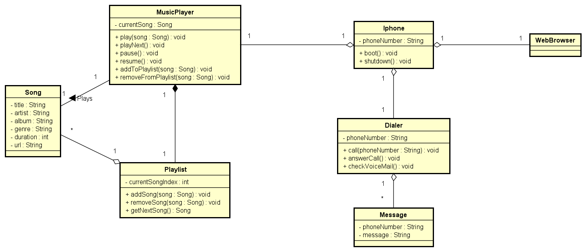

# LabDio-IphoneUML
Repositório com a entrega do laboratório "Modelando o iPhone com UML: Funções de Músicas, Chamadas e Internet", parte do Bootcamp Bradesco - Java Cloud Native 
Este projeto simula funcionalidades básicas de um iPhone utilizando Java.

## Funcionalidades

### Dialer
- `call(String phoneNumber)`: Realiza uma chamada para o número informado.
- `answerCall()`: Atende uma chamada recebida.
- `voiceMail()`: Acessa as mensagens no correio de voz.

### MusicPlayer
- `play(Song song)`: Inicia a reprodução de uma música
- `playNext()`: Busca a próxima música na playlist e toca.
- `pause()`: Pausa a música atual
- `resume()`: Despausa a música atual
- `addToPlaylist(Song song)` Adiciona a música na playlist.
- `removeFromPlaylist(Song song)` Remove a música da playlist.

### WebBrowser
- `showPage(String url)`: Abre a página no navegador e adiciona ás abas.
- `refreshPage()`: Atualzia a aba atual.
- `closePage()`: Fecha a aba atual e remove das abas.

# Diagrama UML do Projeto

