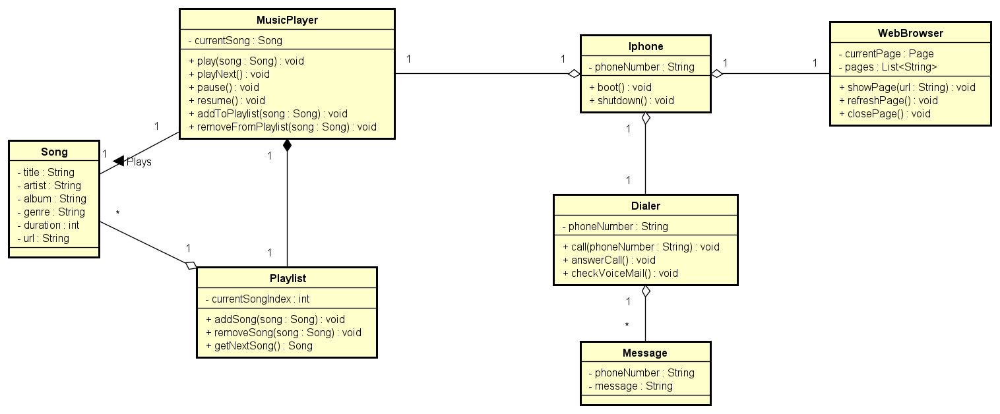

# LabDio-IphoneUML
Repositório com a entrega do laboratório "Modelando o iPhone com UML: Funções de Músicas, Chamadas e Internet", do Bootcamp Bradesco - Java Cloud Native

# Diagrama UML do Projeto

